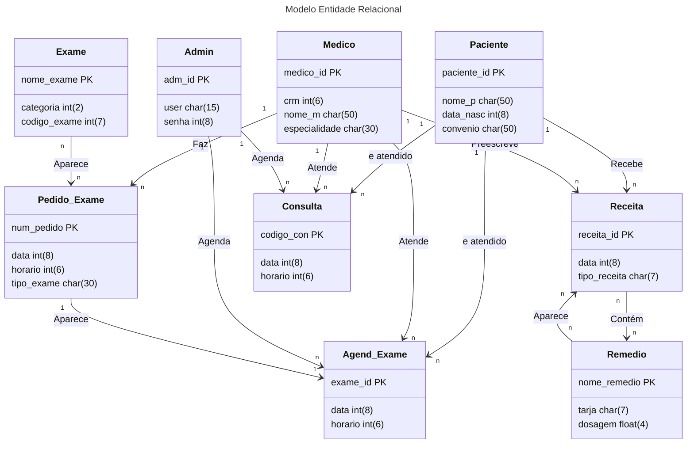

# Modelo Entidade Relacional
## Entidades 

  - **Paciente**
      - `paciente_id` (PK)
      - `nome_p`
      - `data_nasc`
      - `convenio`

 - **Medico**
     - `medico_id` (PK)
     - `crm`
     - `nome_m`
     - `especialidade`

 - **Pedido_Exame**
     - `num_pedido` (PK)
     - `data`
     - `horario`
     - `tipo_exame`

  - **Exame**
      - `nome_exame` (PK)
      - `categoria`
      - `codigo_exame`
  
  - **Agend_Exame**
      - `exame_id` (PK)
      -  `data`
      -  `horário`
  
  - **Receita**
      -  `receita_id` (PK)
      -  `data`
      -  `tipo_receita`

  - **Remedio**
      - `nome_remedio` (PK)
      -  `tarja`
      -  `dosagem`
        
  - **Consulta**
      -  `codigo_con` (PK)
      -  `data`
      -  `horario`
   
  - **Admin**
      - `adm_id` (PK)
      - `user`
      - `senha`

        
## Diagrama MER

