# Modelo Entidade Relacional
## Entidades 

  - **Paciente**
      - `paciente_id` (PK)
      - `nome_p`
      - `data_nasc`
      - `convenio`
      - `cpf`
      - `telefone`

 - **Medico**
     - `medico_id` (PK)
     - `crm`
     - `nome_m`
     - `especialidade`
  
  - **Receita**
      -  `receita_id` (PK)
      -  `data`
      -  `tipo_receita`

  - **Remedio**
      - `nome_remedio` (PK)
      -  `tarja`
      -  `dosagem`
        
  - **Consulta**
      -  `consulta_id` (PK)
      -  `data`
      -  `horario`

  - **Status_Consulta**
      - `status_id` (PK)
      - `descricao_status`
   
  - **Admin**
      - `adm_id` (PK)
      - `user`
      - `senha`
      - `email`

        
## Diagrama MER

```mermaid

---
title: Modelo Entidade Relacional
---

classDiagram
    class Paciente{
        paciente_id PK
        nome_p char(50)
        data_nasc int(8)
        convenio char (50)
    }

    class Medico{
       medico_id PK
       crm int(6)
       nome_m char(50)
       especialidade char(30)
    }

      class Receita{
         receita_id  PK
         data int(8)
         tipo_receita char(7)
    }
      class Remedio{
         nome_remedio  PK
         tarja char(7)
         dosagem float(4)
     }   
       class Consulta{
            consulta_id PK
            data int(8)
            horario int(6)
     }

       class Status_Consulta{
            status_id PK
            descricao_status char(50)
     }
        class Admin{
           adm_id  PK
           user  char(15)
           senha  int(8)
    }
     

    Receita "n" --> "n" Remedio : Contém
    Remedio "n" --> "n" Receita : Aparece

    Paciente "1" --> "n" Consulta : e atendido
    Medico "1" --> "n" Consulta  : Atende
    Admin "1" --> "n" Consulta : Agenda
    
    Paciente "1" --> "n" Receita : Recebe
    Medico "1" --> "n" Receita : Preescreve

    Consulta "n" --> "1" Status_Consulta : Tem

    Paciente "n" <--> "n" Medico : Tem

    Receita "n" --> "1" Consulta : e dada

    
    
   
    








``` 

