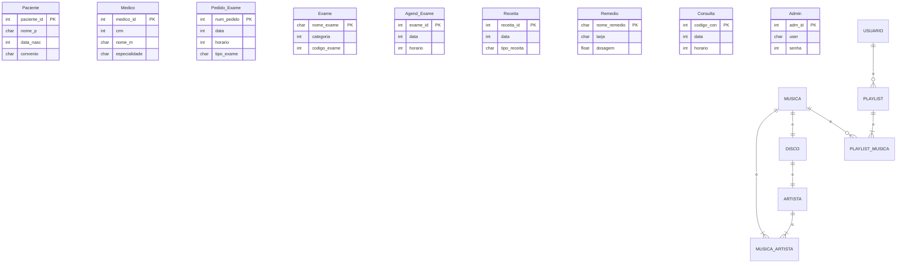

## Diagrama MER

```mermaid
erDiagram
     Paciente{
        int paciente_id PK
        char nome_p
        int data_nasc 
        char convenio
        }


     Medico{
       int medico_id PK
       int crm
       char nome_m 
       char especialidade
        }


      Pedido_Exame{
        int num_pedido PK
        int data 
        int horario
        char tipo_exame
        }


      Exame{
        char nome_exame PK
        int categoria
        int codigo_exame
        }


       Agend_Exame{
          int exame_id  PK
          int data
          int horario
        }

       Receita{
         int receita_id  PK
         int data
         char tipo_receita
        }


       Remedio{
         char nome_remedio  PK
         char tarja 
         float dosagem 
         }

 
       Consulta{
            int codigo_con PK
            int data
            int horario
         }


        Admin{
           int adm_id  PK
           char user
           int senha
         }

    MUSICA ||--|{ MUSICA_ARTISTA: o
    ARTISTA ||--|{ MUSICA_ARTISTA : o
    MUSICA ||--|| DISCO : o
    DISCO ||--|| ARTISTA : o
    USUARIO ||--o{ PLAYLIST : o
    PLAYLIST ||--|{ PLAYLIST_MUSICA : o 
    MUSICA ||--o{ PLAYLIST_MUSICA : o


```
