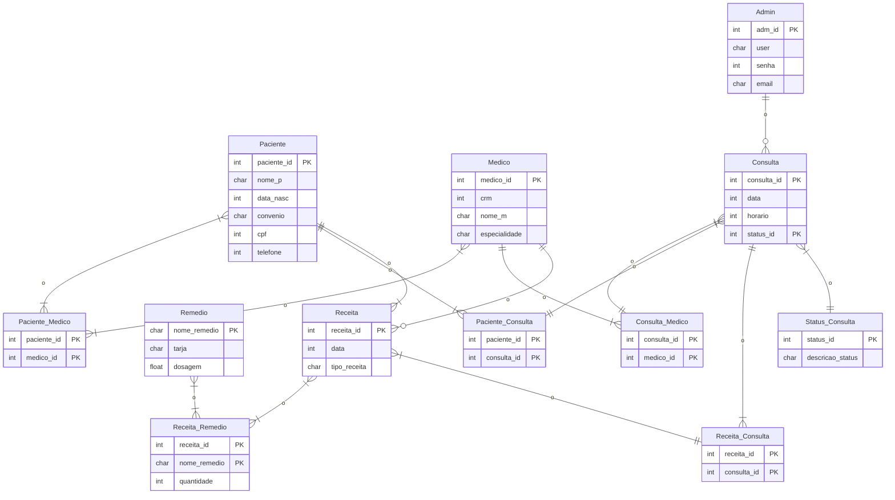

## Diagrama MR

```mermaid
erDiagram
       Paciente{
         int paciente_id PK
         char nome_p
         int data_nasc 
         char convenio
         int cpf
         int telefone 
        }

       Medico{
         int medico_id PK
         int crm
         char nome_m 
         char especialidade
        }

       Receita{
         int receita_id  PK
         int data
         char tipo_receita
        }

       Remedio{
         char nome_remedio  PK
         char tarja 
         float dosagem 
         }

       Consulta{
           int consulta_id PK
           int data
           int horario
           int status_id PK 
         }

       Status_Consulta{
           int status_id PK 
           char descricao_status
         } 

        Admin{
           int adm_id  PK
           char user
           int senha
           char email  
         }

        Paciente_Consulta{
           int paciente_id PK    
           int consulta_id PK    
         }

        Paciente_Medico{
           int paciente_id PK    
           int medico_id PK    
         }

        Consulta_Medico{
           int consulta_id PK
           int medico_id PK
         }

        Receita_Consulta{
           int receita_id  PK
           int consulta_id PK
        }

        Receita_Remedio{
           int receita_id  PK
           char nome_remedio  PK
           int quantidade
        }


    Paciente }|--|{ Paciente_Medico : o
    Medico }|--|{ Paciente_Medico: o
    Medico ||--|{ Consulta_Medico: o
    Consulta }|--|| Consulta_Medico : o

    
    Paciente ||--|{ Paciente_Consulta : o
    Consulta }|--|| Paciente_Consulta : o

    Receita }|--|{ Receita_Remedio: o
    Receita }|--|| Receita_Consulta: o
    Consulta ||--|{ Receita_Consulta : o
    Paciente ||--|{ Receita : o
    Medico ||--o{ Receita: o
     
    Consulta }|--|| Status_Consulta : o 
    
    Remedio }|--|{ Receita_Remedio : o
   
    Admin ||--o{ Consulta : o
    


```
